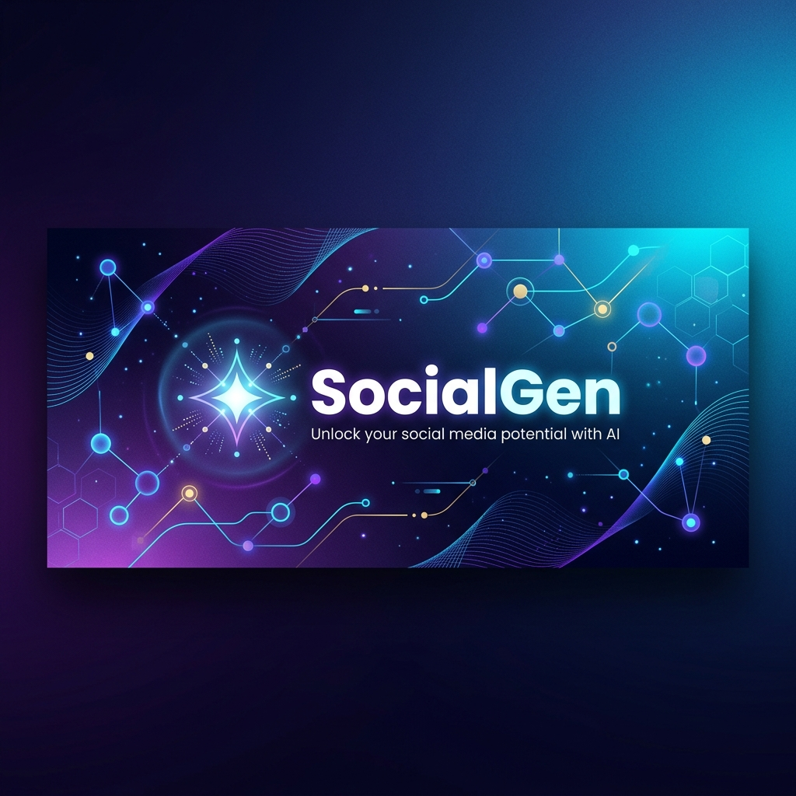

<div align="center">
  

  # 🚀 SocialGen

  ### *AI-Powered Social Media Content Generation & Campaign Planning Platform*

  [](https://react.dev/)
  [](https://vite.dev/)
  [](https://tailwindcss.com/)
  [](https://nodejs.org/)
  [](https://expressjs.com/)
  [-003b57?logo=sqlite&logoColor=white&style=for-the-badge)](https://www.sqlite.org/)
  [](https://deepmind.google/technologies/gemini/)

  <p align="center">
    <a href="#-overview">Overview</a> •
    <a href="#-key-features">Key Features</a> •
    <a href="#-project-structure">Project Structure</a> •
    <a href="#-tech-stack">Tech Stack</a> •
    <a href="#-getting-started">Getting Started</a> •
    <a href="#-environment-variables-reference">Environment Variables</a> •
    <a href="#-api-reference">API Reference</a>
  </p>
</div>

---

## 🌟 Overview

**SocialGen** is a modern, premium SaaS application designed to empower marketers, content creators, and brand managers. By leveraging the advanced text-reasoning and language generation capabilities of Google's **Gemini 2.5 Flash** model, SocialGen streamlines the workflow of generating high-fidelity blogs, creating platform-specific social copy, maintaining a visual campaign calendar, and tracking community engagement and sentiment metrics.

---

## ✨ Key Features

*   🤖 **AI-Driven Copywriting**: Generate 800–1500 word authoritative articles complete with structured takeaways, conclusions, and catchiness.
*   🎭 **Brand Voice Personalization**: Tailor AI content using slide-controls for formality, humor, energy, technicality, and warmth, plus inclusion/exclusion word lists.
*   📅 **Dynamic Campaign Calendar**: Schedule, visualize, and organize multi-channel campaign activities in a unified, calendar-centric dashboard.
*   📊 **Real-time Analytics**: Monitor key performance indicators, count post engagements (likes, shares, comments), and analyze sentiment tracking.
*   🔗 **Cross-Platform Scheduling & Publishing**: Connect LinkedIn, Twitter/X, and Meta (Facebook/Instagram) profiles via OAuth to publish updates on demand.
*   🔒 **Secure Multi-Tenant Architecture**: Robust session management and account pairing secured by bcrypt-hashed passwords and JSON Web Tokens (JWT).

---

## 📂 Project Structure

```text
social-marketing-saas/
├── frontend/                     # React + Vite Client (Single Page Application)
│   ├── src/
│   │   ├── components/           # Reusable widgets, Layout, Navbar, ProtectedRoute
│   │   ├── pages/                # Auth, Dashboard, Calendar, Blog Generator, Settings
│   │   ├── context/              # Authentication & Global state contexts
│   │   └── services/             # HTTP API Client wrappers (Axios)
│   └── package.json
│
├── backend/                      # Node.js + Express API Server
│   ├── src/
│   │   ├── config/               # Environment variable loaders & CORS origins
│   │   ├── db/                   # Native SQLite (DatabaseSync) connection & schema
│   │   ├── middleware/           # Protected routes authentication check (JWT)
│   │   ├── routes/               # API endpoints (Auth, AI, Calendar, Dashboard, Social)
│   │   ├── services/             # Gemini AI, OAuth Managers, Publishing Schedulers
│   │   ├── utils/                # Standardized date formats & error handlers
│   │   └── server.js             # Express startup file
│   ├── data/                     # Local file storage for SQLite database (saas.db)
│   └── package.json
│
├── APIS_SETUP.md                 # Production Guide for obtaining Developer OAuth credentials
├── social_gen_banner.png         # Project Visual Banner
└── README.md                     # Platform Documentation
```

---

## 🛠️ Tech Stack

### Frontend
- **React 19** & **Vite** — Single Page Application with optimized bundlers.
- **Tailwind CSS v4** — High-performance utility styles.
- **React Router v7** — Declarative client-side routing.
- **Lucide Icons** — Lightweight vector iconography.
- **Axios** — Promised-based HTTP request lifecycle.

### Backend & Database
- **Node.js** & **Express** — Flexible, modular server routing.
- **Native SQLite (`node:sqlite`)** — Ultra-fast, synchronous file-based relational database using Node's standard `DatabaseSync` engine (no external binary compilation needed).
- **JWT & bcryptjs** — Secure user authentication and salted crypt hashes.
- **Firebase Admin SDK** — Integration hooks for optional document/cloud sync.

### Artificial Intelligence
- **Google Gemini 2.5 Flash** — REST-driven content creation using contextual copywriting prompts.

---

## 🚀 Getting Started

Follow the steps below to run SocialGen in your local development environment:

### Prerequisites
- **Node.js** (v22+ recommended for native `node:sqlite` DatabaseSync support)
- An active **Google Gemini API Key**

---

### Step 1: Clone & Configure the Backend

1. Navigate to the `backend/` directory:
   ```bash
   cd backend
   ```

2. Copy the example environment template:
   ```bash
   cp .env.example .env
   ```

3. Open `.env` and fill in the required keys:
   ```env
   PORT=8000
   JWT_SECRET_KEY=your_secure_jwt_secret
   GEMINI_API_KEY=your_google_gemini_api_key
   ```

4. Install backend dependencies:
   ```bash
   npm install
   ```

5. Start the development server (runs with `--watch` mode):
   ```bash
   npm run dev
   ```
   *The backend API server will start listening at `http://127.0.0.1:8000`.*

---

### Step 2: Configure & Start the Frontend

1. Navigate to the `frontend/` directory:
   ```bash
   cd ../frontend
   ```

2. Install frontend dependencies:
   ```bash
   npm install
   ```

3. Launch the Vite dev server:
   ```bash
   npm run dev
   ```
   *The client interface will boot up at `http://localhost:5173`.*

---

## 🔑 Environment Variables Reference

| Variable Name | Description | Default / Example Value |
| :--- | :--- | :--- |
| `PORT` | The port the Express backend runs on | `8000` |
| `JWT_SECRET_KEY` | Secret token used to sign authentication cookies/tokens | `8f39c87d4615a1e2f3d4a...` |
| `GEMINI_API_KEY` | API Key for accessing Google Gemini generative models | `AIzaSy...` |
| `LINKEDIN_CLIENT_ID` | OAuth Client ID for LinkedIn App integrations | `*Optional*` |
| `LINKEDIN_CLIENT_SECRET` | OAuth Secret Key for LinkedIn App integrations | `*Optional*` |
| `TWITTER_CLIENT_ID` | OAuth Client ID for Twitter/X App integrations | `*Optional*` |
| `TWITTER_CLIENT_SECRET` | OAuth Secret Key for Twitter/X App integrations | `*Optional*` |
| `META_CLIENT_ID` | Facebook/Instagram App ID for integrations | `*Optional*` |
| `META_CLIENT_SECRET` | Facebook/Instagram App Secret Key | `*Optional*` |

---

## 🔗 OAuth Credentials & Posting Setup

To configure posting permissions for LinkedIn, Twitter, and Meta, refer to the step-by-step developer account creation guide in [APIS_SETUP.md](APIS_SETUP.md).

---

## 🌐 API Reference

### 🔐 Auth Endpoints

| HTTP Method | Endpoint | Description | Auth Required |
| :--- | :--- | :--- | :---: |
|  | `/api/auth/register` | Register a new user | ❌ |
|  | `/api/auth/login` | Authenticate and return JWT token | ❌ |
|  | `/api/auth/me` | Retrieve profile info & settings of active user | 🔑 |
|  | `/api/auth/me` | Update brand voice rules and user API keys | 🔑 |

### 📅 Campaign Calendar

| HTTP Method | Endpoint | Description | Auth Required |
| :--- | :--- | :--- | :---: |
|  | `/api/calendar` | List all campaign schedules for user | 🔑 |
|  | `/api/calendar` | Create a new campaign entry | 🔑 |
|  | `/api/calendar/:id` | Retrieve single campaign details | 🔑 |
|  | `/api/calendar/:id` | Modify an existing campaign schedule | 🔑 |
|  | `/api/calendar/:id` | Cancel/Delete a scheduled campaign | 🔑 |

### 🤖 AI Generation Jobs

| HTTP Method | Endpoint | Description | Auth Required |
| :--- | :--- | :--- | :---: |
|  | `/api/ai/jobs` | Queue a new content generation request | 🔑 |
|  | `/api/ai/jobs` | Fetch historical list of AI jobs | 🔑 |
|  | `/api/ai/jobs/:id` | Check status/results of a generation job | 🔑 |
|  | `/api/ai/jobs/:id` | Update generated text/captions manually | 🔑 |
|  | `/api/ai/jobs/:id` | Delete generated item from record | 🔑 |
|  | `/api/ai/jobs/:id/retry` | Re-run a failed generation request | 🔑 |

### 📊 Dashboard & System

| HTTP Method | Endpoint | Description | Auth Required |
| :--- | :--- | :--- | :---: |
|  | `/api/health` | Check backend server status | ❌ |
|  | `/api/dashboard/overview` | Fetch cumulative campaign statistics | 🔑 |

---

## 📜 License

This project is licensed under the MIT License.
