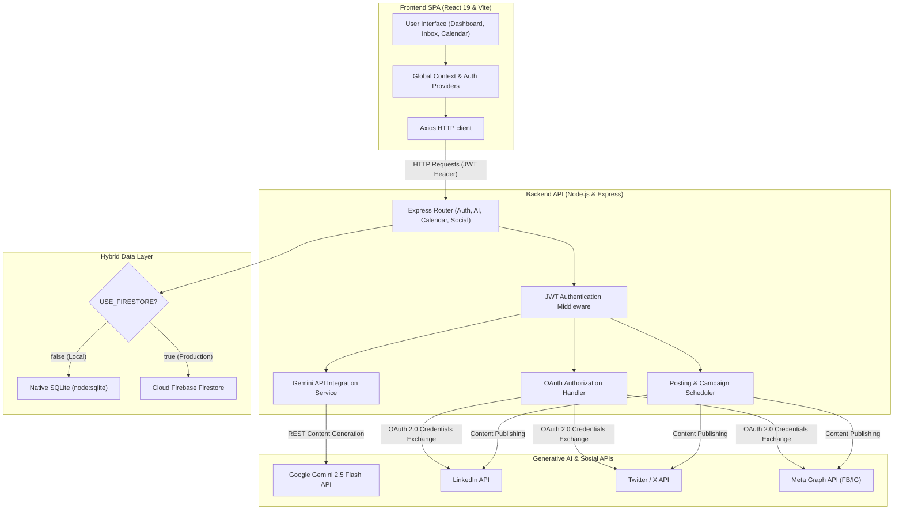
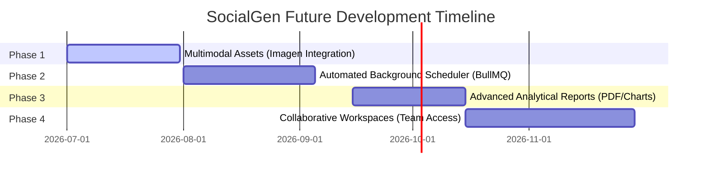

# 🚀 SocialGen Documentation

### *AI-Powered Social Media Content Generation & Campaign Planning Platform*

---

## 📌 Table of Contents
1. [💡 The Idea & Vision](#-the-idea--vision)
   - [The Problem](#the-problem)
   - [The Vision](#the-vision)
2. [🧪 Proof of Concept (PoC)](#-proof-of-concept-poc)
   - [Key PoC Hypotheses & Validation](#key-poc-hypotheses--validation)
3. [🏗️ System Architecture](#-system-architecture)
   - [Architectural Diagram](#architectural-diagram)
   - [Database Portability Layer](#database-portability-layer)
   - [Asynchronous Generation Pipeline](#asynchronous-generation-pipeline)
4. [🛠️ Tech Stack](#-tech-stack)
5. [🌟 Core Features & Solution Showcase](#-core-features--solution-showcase)
   - [1. AI Copilot & Copywriter](#1-ai-copilot--copywriter)
   - [2. Brand Voice Tuner](#2-brand-voice-tuner)
   - [3. Dynamic Campaign Calendar](#3-dynamic-campaign-calendar)
   - [4. Unified Social Inbox & Sentiment Monitoring](#4-unified-social-inbox--sentiment-monitoring)
   - [5. Content Remixer](#5-content-remixer)
   - [6. Hashtag Search Lab](#6-hashtag-search-lab)
6. [🔮 Future Roadmap](#-future-roadmap)

---

## 💡 The Idea & Vision

### The Problem
In today's digital landscape, social media marketing is highly fragmented. Content creators, brand managers, and marketers face several critical bottlenecks:
* **Multi-Tool Chaos**: Writing a blog, optimizing it for LinkedIn, condensing it for Twitter/X, and scheduling it on a calendar requires jumping between multiple web apps, document editors, and browser tabs.
* **Inconsistent Brand Tone**: Handing content generation to generic AI tools often yields sterile, robotic copy that fails to match the brand's unique identity, resulting in disjointed messaging across channels.
* **Manual Community Moderation**: Checking comments across LinkedIn, Twitter, and Facebook, identifying customer sentiments, and replying to queries requires active, time-consuming effort.

### The Vision
**SocialGen** is a modern SaaS platform designed to streamline the marketing lifecycle. By consolidating content generation, brand tuning, campaign planning, and community moderation into a single workspace, SocialGen acts as an AI marketing copilot. 

With **Google Gemini 2.5 Flash** at its core, SocialGen translates brief content ideas into comprehensive articles, generates tailored promotional copy, manages schedule visualization, and analyzes community interactions in real time.

---

## 🧪 Proof of Concept (PoC)

To prove that a unified AI campaign manager could run with low latency and high quality, the PoC validated several crucial hypotheses:

### Key PoC Hypotheses & Validation

1. **AI Output Structuring (One-Shot Generation)**
   * *Hypothesis*: Can a single LLM request generate an 800–1500 word blog post and produce three platform-specific promotional captions (LinkedIn, Twitter/X, Instagram) without mixing them up?
   * *Validation*: Verified using custom structured markdown formatting and clear section separators. The backend extracts, splits, and formats the output into separate database fields.

2. **Continuous Brand Voice Calibration**
   * *Hypothesis*: Can standard numeric sliders (0-100% for Humor, Formality, Technicality, Energy, Warmth) be successfully interpreted by Gemini to alter the tone of the output?
   * *Validation*: Calibrated prompts map the sliders to descriptive percentages in system prompts (e.g., *Formality: 80% — use authoritative and sophisticated language*). Results show consistent adherence to tone limits.

3. **Hybrid Database Portability**
   * *Hypothesis*: Can we build a backend that runs locally with zero installation dependencies, yet scale instantly to a cloud environment when deployed?
   * *Validation*: Developed a database abstraction wrapper. Setting `USE_FIRESTORE=true` switches the application from native SQLite (`node:sqlite` DatabaseSync) to Firebase Firestore without rewriting routes.

4. **Multi-Channel OAuth Consolidation**
   * *Hypothesis*: Can a unified callback URL process OAuth authorizations from different networks (LinkedIn, Twitter, Meta) securely?
   * *Validation*: Implemented a Base64-encoded state variable: `Buffer.from('${userId}:${platform}:${frontendOrigin}').toString('base64')`. The single callback endpoint decodes state, exchanges tokens, updates the user's connection profile, and redirects back to the front-end.

---

## 🏗️ System Architecture

SocialGen implements a decoupled Client-Server architecture utilizing a hybrid data layer to maximize portability.

### Architectural Diagram



### Database Portability Layer
To achieve database portability, the application abstracts queries using helper functions (`queries.js`). The server checks the environment status on startup:
* **SQLite Sync Engine**: Utilizing the native `DatabaseSync` class introduced in Node.js (v22+). This provides synchronous, high-performance local database access, eliminating external native binary compilation.
* **Firestore Engine**: Leverages `firebase-admin` to sync user profiles, scheduled campaigns, AI jobs, and community comments with cloud-hosted collections.

### Asynchronous Generation Pipeline
Generating a comprehensive 1500-word article alongside multiple platform captions can take several seconds. To prevent blocking client requests:
1. The client posts a job to `/api/ai/jobs` with the desired parameters.
2. The server creates an `ai_job` entry with a `pending` status, returns the job object immediately to the client with a `201 Created` code, and releases the HTTP thread.
3. A background process (`runAiGenerationTask`) is queued using `process.nextTick()`.
4. The background task fetches the user's specific brand settings, runs the Gemini API query, updates the database status to `completed` (or `failed` in case of error), and saves the generated Markdown.
5. The React client polls `/api/ai/jobs/:id` or uses state context to update the UI when the job is ready.

---

## 🛠️ Tech Stack

| Component | Technology | Description |
| :--- | :--- | :--- |
| **Frontend Framework** | **React 19** | Modern UI rendering with advanced concurrent rendering capabilities. |
| **Build Tool** | **Vite** | Fast hot-module-replacement (HMR) and optimized bundler. |
| **Styling** | **Tailwind CSS v4** | Next-generation performance utility styling. |
| **Router** | **React Router v7** | Declarative page navigation and guard route loaders. |
| **Icons** | **Lucide React** | Scalable vector icons. |
| **API Client** | **Axios** | Promised-based HTTP requests with custom interceptors. |
| **Runtime** | **Node.js** | Server environment (recommended v22+). |
| **Server Framework**| **Express** | Lightweight REST APIs routing and middleware architecture. |
| **Local DB** | **Native SQLite** | Synchronous relational database via `node:sqlite`. |
| **Cloud DB** | **Firebase Firestore**| Optional document store synchronization. |
| **Auth** | **JWT & bcryptjs** | Secure token-based session management and password hashing. |
| **Generative AI** | **Google Gemini 2.5 Flash** | Context-driven copywriting, remixing, and analysis. |

---

## 🌟 Core Features & Solution Showcase

### 1. AI Copilot & Copywriter
* **How it works**: The generation interface collects the content topic, keywords, target audience, content goals, and platform. It executes the background job which prompts the Gemini API.
* **The Solution**: Produces a structured Markdown file that includes:
  - An attention-grabbing title.
  - A comprehensive intro, detailed body, actionable takeaways, and a conclusion.
  - Tailored social captions ready for Twitter, LinkedIn, and Instagram.

```javascript
// Prompt construction sample
const prompt = `
  You are an expert copywriter. Write a blog post and social promotions:
  Topic: ${job.topic}
  Tone: ${job.tone}
  Target Audience: ${job.audience}
  Platform: ${job.platform}
  
  Format the output as clean Markdown:
  1. Start with a Title.
  2. Write an article (800 - 1500 words).
  3. Add a section separator "---" followed by "# Social Media Promotional Captions".
  4. Provide 3 different promotional social captions tailored to: Twitter, LinkedIn, Instagram.
`;
```

### 2. Brand Voice Tuner
* **How it works**: Brand voice preferences are stored on the user's profile as a JSON configuration.
* **The Solution**: Before sending prompts to Gemini, the backend appends instructions mapping the user's brand parameters. This ensures the output maintains a consistent tone, includes key phrases, and excludes specific keywords.

```json
{
  "sliders": {
    "formality": 80,
    "humor": 20,
    "energy": 60,
    "technicality": 90,
    "warmth": 40
  },
  "keywords": ["enterprise SaaS", "scalability"],
  "avoidWords": ["synergy", "paradigm shift"]
}
```

### 3. Dynamic Campaign Calendar
* **How it works**: A calendar dashboard provides an interactive view of all marketing campaigns.
* **The Solution**: Users schedule campaigns specifying start/end dates, platform, frequency (Daily, Weekly, Bi-weekly), and goals. Scheduled items are displayed on a monthly view where users can add, reschedule, or cancel generation tasks.

### 4. Unified Social Inbox & Sentiment Monitoring
* **How it works**: Combines incoming user comments across connected social media handles.
* **The Solution**: Automatically classifies incoming comments into three sentiment categories (**Positive**, **Neutral**, **Negative**). 
  - **Starring System**: Flag critical queries or complaints that require team follow-up.
  - **Inline Reply Composer**: Post responses back to comments directly from the dashboard.

### 5. Content Remixer
* **How it works**: Adapts existing materials (such as a newsletter or a raw draft) into new formats.
* **The Solution**: The user pastes existing content, selects a target tone, and requests a remix. The server prompts Gemini to output platform-optimized versions:
  - **Twitter/X**: Constrained to the 280-character limit, focused on brevity.
  - **LinkedIn**: Structured with an engaging hook and professional layout.
  - **Instagram**: Styled with high visual formatting cues.
  - **Newsletter**: Structured as a clean email digest.

### 6. Hashtag Search Lab
* **How it works**: Generates trending and relevant hashtags.
* **The Solution**: Accepts a seed topic and categorizes recommendations into three tiers (High Reach, Medium Reach, and Niche) to help optimize visibility.

---

## 🔮 Future Roadmap

To transition SocialGen from an interactive campaign planner to an enterprise-grade automation engine, the following capabilities are planned:



1. **Multimodal Media Generation (Imagen Integration)**
   * Extend the generation workflow to create corresponding promotional images using Google's **Imagen** models or Stable Diffusion. This would automate the creation of visually rich campaign posts.

2. **Automated Background Scheduler (BullMQ & Redis)**
   * Transition the calendar scheduler from a manual visual organizer into an automated publishing queue. A background task running on a scheduler (e.g., BullMQ) will auto-trigger postings at scheduled times.

3. **Advanced Performance Analytics**
   * Incorporate reporting dashboards with graphs (such as Recharts) showing cumulative post views, click-through rates (CTR), and engagement growth, with support for automated weekly email reports and PDF exports.

4. **Collaborative Workspaces**
   * Expand the platform database schema to support team accounts. This would enable role-based access control (RBAC), allowing administrators to invite editors to review, adjust, and approve drafts before publication.
